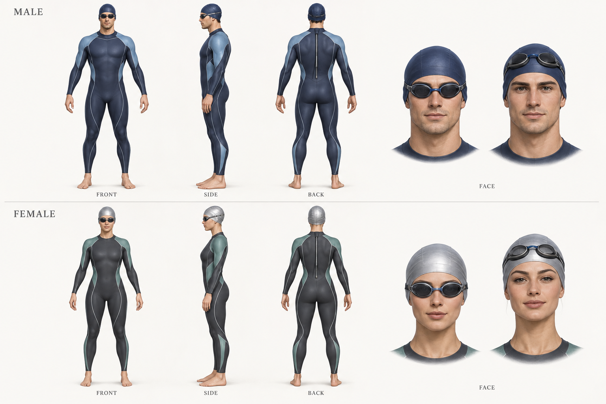

# 海洋旅程：角色设计基线 v1

## 本次交付与边界

本轮确定美术制作方向，并提供可查看当前实际模型的独立 3D 观察室。下图是建模参考概念稿，不是已上线模型；新男女网格、泳装与帽体制作属于下一阶段。观察室不加载概念图来冒充实际游戏模型。



## 共同风格

- 成年开放水域运动员，偏写实的游戏美术；轮廓清楚、神态自然、姿态自信。体型不是用户身高体重的精确映射，也不是健康评价标准。
- 两套最终可辨识的脸型和体型；可共用基础拓扑、骨骼命名与动作。禁止只通过整体横向缩放或颜色区分。
- 两套不同剪裁的专业全身 wetsuit；统一海湾运动装备语言，避免夸张肌肉、夸张性征、卡通大头或真实商业品牌。
- 材质分成皮肤、硅胶帽、镜片、镜框、橡胶织物与缝线。皮肤有柔和粗糙度变化；泳衣以哑光为主，帽体是硅胶而非金属。概念图中的强高光不直接作为材质参数。

## 男角色

- 利落帅气：清楚的眉骨、下颌和鼻部转折，平静专注的眼神；不采用过分尖锐下巴或僵硬微笑。
- 肩背稍宽、腰线清晰，胸背与四肢有自然运动体积，避免健美式膨胀。
- 深海蓝主体、低饱和冰蓝肩背分区、少量银灰接缝。深蓝泳帽配低调镜框。

## 女角色

- 自信飒爽：独立的眉眼、颧骨和下颌轮廓，抬头自然；保持运动员气质，避免过度妆感。
- 颈肩、背部和腿部有力量感，胸腰胯自然衔接；不直接从男角色整体缩窄得到。
- 石墨色主体、低饱和海绿肩侧分区、少量珍珠白接缝。浅银灰硅胶帽与深色镜框，浅帽不做金属反射。

## 装备与建模要求

- 帽沿完整贴合前额、太阳穴、耳上和后脑；两套帽体分别适配头型。泳镜带落在帽面，回头和换气时不悬空、不穿头。
- 泳衣领口、袖口、脚踝收口与后背拉链具有真实结构。贴合大面可用材质和法线表达；收口、拉链等关键轮廓有独立几何。不要无差别叠加全身厚壳。
- 先做中性站姿与三视图；再测试高肘回臂、前伸、抱水、侧头换气和踢腿。
- 米制单位，直立时 +Y 向上、+Z 为面部方向；保留现有 `head`、`neck01`、`oris01`、`eye_L/R`、躯干与四肢骨骼语义。帽镜位置应由新模型锚点校准，不能直接沿用旧固定偏移。
- 模型文件、材质与装备应能独立替换。先在观察室验收，再接入海面。

## 观察室使用

在旅程页选择角色后，点击“查看 3D 角色”。支持正面、侧面、背面、面部近景，拖动环绕、缩放及主动开启自动旋转。默认静止；选择固定角度会停止旋转。离屏或后台暂停自动旋转，收起时卸载实例并释放独有资源。

观察室复用当前实际 GLB 的独立克隆，以标准比例和中性灯光显示，无海面遮挡。预览不会修改共享资产、当前游泳实例、积分或存档。当前 SVG 选择图仍是示意图，真实模型缩略图替换属于后续资产阶段。

## 下一阶段验收

1. 同一灯光、相机、尺度拍摄男女正/侧/背、面部与灰色材质轮廓图；灰色轮廓仍应能看出差异。
2. 脸部、帽沿、泳镜、颈肩、腋下、腰胯和脚踝分别做近景检查；不能只验证帽体尺寸与颜色数组。
3. 每套角色固定记录前伸、抱水、高肘回臂、左右换气、踢腿关键帧；检查关节塌陷、衣物穿插和嘴部出水。
4. 自动测试继续负责状态、资源隔离、动作范围和数值稳定。固定镜头截图作为人工视觉验收依据，测试通过不等于美术质量通过。

## 生成记录

使用内置 imagegen 生成，未使用 CLI/API fallback。原稿为一张男女三视图与面部参考合板。以下为完整提示词：

```text
Use case: stylized-concept. Asset type: production character art-direction reference sheet for an existing open-water swimming game, NOT a screenshot of an implemented model. Create one high-resolution wide character turnaround sheet on an off-white neutral studio background. Two rows, each with three full-body orthographic views aligned at feet and head: front, exact side, back. Upper row: a handsome adult male open-water swimmer, age about 28, athletic lean natural build, defined shoulder/back taper, clear jawline and brow, relaxed confident expression. Lower row: an attractive confident adult female open-water swimmer, age about 28, strong athletic neck/shoulder and leg silhouette, distinct face and natural balanced waist/hips, poised sporty presence. Both are adults, realistic anatomy and moderate muscle, no exaggerated sexual features. Semi-realistic premium game character rendering, readable clean forms, not chibi, not photoreal celebrity. Both wear their own specifically tailored professional full-length open-water wetsuit: male deep navy with desaturated ice-blue shoulder panels and fine silver seams; female graphite with restrained sea-green shoulder/side panels and pearl-white seam details. Match garment panel layout across front/side/back; actual neckline, wrist and ankle cuffs, panel seams, subtle fabric thickness and back zipper pull. Full silicone swim caps fitted over temples and back of skull, smooth continuous forehead and ear-side edge, fine tension wrinkles; male navy cap, female pale silver cap; no exposed bald patch. Proper fitted low-profile goggles and a strap contacting cap. Bare feet and hands visible. Neutral standing A-pose with arms only 15 degrees away from body, relaxed hands. Three views in each row must depict the same individual consistently, identical head size, proportions and suit design. At right of each row include two small head studies of that SAME character: cap and goggles worn properly, and a face study with goggles lifted onto the cap showing eyes, brows and face. Soft neutral key/fill lighting, clear silhouettes, no water, no scenery, no dramatic shadows, no real brand, no logo, no watermark. Minimal labels only: MALE, FEMALE, FRONT, SIDE, BACK, FACE. Prioritize practical modeling reference, full unclipped bodies and consistent identity across views.
```
